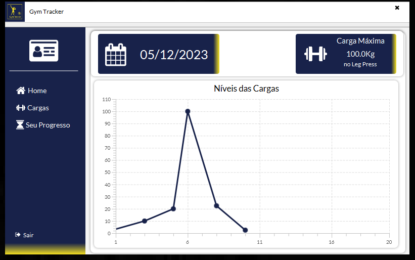
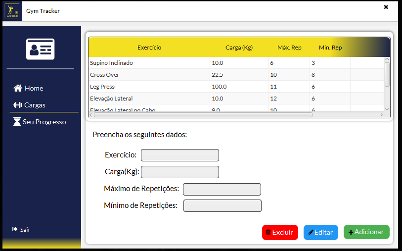
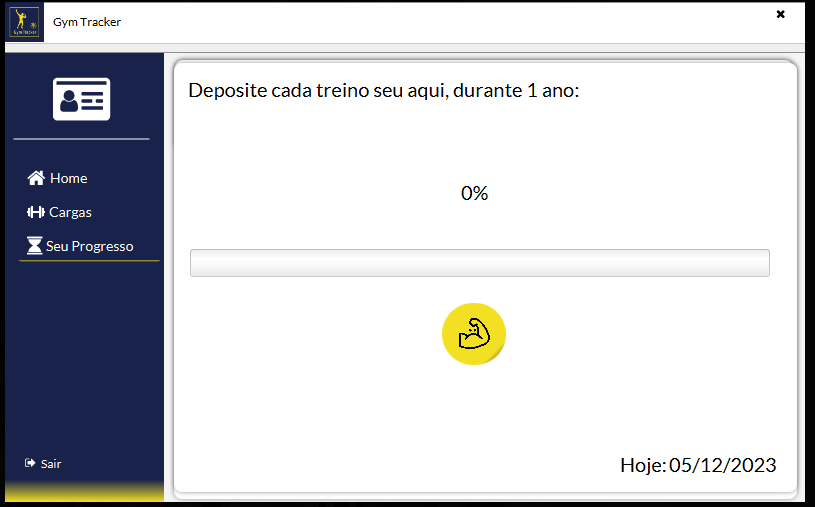
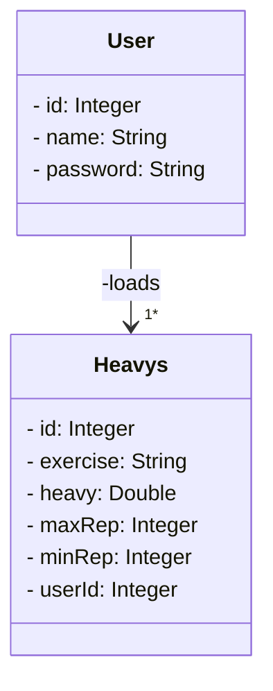

  <h1>Imagens da aplicação</h1>
  <table style="display: inline-table;">
    <tr>
      <td align="center">Login</td>
      <td align="center">Home</td>
      <td align="center">Carga(as)</td>
      <td align="center">Barra de Progresso</td>
    </tr>
  </table>

 
<h4>
   Aplicação que gerencia o desempenho de usuários que praticam musculação, para otimizar e monitorar seu desempenho de maneira eficaz. Neste contexto, o projeto é dedicado ao         gerenciamento integral do desempenho de usuários engajados na prática da musculação.  
   Oferecendo uma experiência intuitiva e abrangente, fornecendo ferramentas para o acompanhamento de treinos, análise de progresso, definição de metas 
   personalizadas. 
 

<h2 align="center">Tecnologias Usadas</h2>
   
    <h4 align="center"> 
      

       
       Java
       
       CSS3
       
       MySQL Database
       

   </h4>

 
    <h2 align="center">UML</h2>

<h3> Destrinchando a estrutura: </h3>

🔹 `User`: Entidade que representa um usuário(a) que armazena informações como id, nome, senha e o os pesos ao qual ele pertence.

🔹 `Heavys`: Entidade que representa as cargas do usuário(a) de um determinado exercício, peso, repetições mínimas e máximas e um identificador para cada usuário.

- `1*`: Expressão utilizada para demonstrar uma 'dependência' ou associação entre as entidades, que neste caso trata-se de que um `User` deve ter **1 ou mais** `- loads`. 

> Com essa dependência entre as classes, é garantido que cada `User` tenha seus dados armazenados e presistidos nos `Heavys`.
